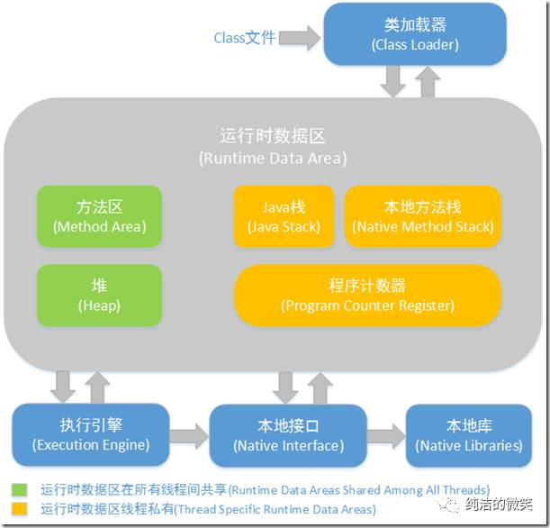

## JVM的内存结构大概分为：

* 堆（Heap）：线程共享。所有的对象实例以及数组都要在堆上分配。回收器主要管理的对象。
* 方法区（Method Area）：线程共享。存储类信息、常量、静态变量、即时编译器编译后的代码。
* 方法栈（JVM Stack）：线程私有。存储局部变量表、操作栈、动态链接、方法出口，对象指针。
* 本地方法栈（Native Method Stack）：线程私有。为虚拟机使用到的Native 方法服务。如Java使用c或者c++编写的接口服务时，代码在此区运行。
* 程序计数器（Program Counter Register）：线程私有。有些文章也翻译成PC寄存器（PC Register），同一个东西。它可以看作是当前线程所执行的字节码的行号指示器。指向下一条要执行的指令。

JVM内存结构主要有三大块：__堆内存、方法区和栈__。堆内存是JVM中最大的一块由年轻代和老年代组成，而年轻代内存又被分成三部分，__Eden空间、From Survivor空间、To Survivor空间__,默认情况下年轻代按照8:1:1的比例来分配；

方法区存储类信息、常量、静态变量等数据，是线程共享的区域，为与Java堆区分，方法区还有一个别名Non-Heap(非堆)；栈又分为java虚拟机栈和本地方法栈主要用于方法的执行

## jVM 内存结构布局及相关控制参数

### 控制参数

* -Xms设置堆的最小空间大小。
* -Xmx设置堆的最大空间大小。
* -XX:NewSize设置新生代最小空间大小。
* -XX:MaxNewSize设置新生代最大空间大小。
* -XX:PermSize设置永久代最小空间大小。
* -XX:MaxPermSize设置永久代最大空间大小。
*  -Xss设置每个线程的堆栈大小。

没有直接设置老年代的参数，但是可以设置堆空间大小和新生代空间大小两个参数来间接控制。

` __老年代空间大小=堆空间大小-年轻代大空间大小__ `

从更高的一个维度再次来看JVM和系统调用之间的关系

方法区和对是所有线程共享的内存区域；而java栈、本地方法栈和程序员计数器是运行是线程私有的内存区域。

## java 堆(Heap)

对于大多数应用来说，Java堆（Java Heap）是Java虚拟机所管理的内存中 __最大__ 的一块。Java堆是被所有线程共享的一块内存区域，在虚拟机启动时创建。此内存区域的唯一目的就是存放对象实例， __几乎所有的对象实例都在这里分配内存__。

Java堆是垃圾收集器管理的主要区域，因此很多时候也被称做 __“GC堆”__ 。如果从内存回收的角度看，由于现在收集器基本都是采用的分代收集算法，所以Java堆中还可以细分为： __新生代和老年代；再细致一点的有Eden空间、From Survivor空间、To Survivor空间等__。

根据Java虚拟机规范的规定，Java堆可以处于物理上不连续的内存空间中，只要逻辑上是连续的即可，就像我们的磁盘空间一样。在实现时，既可以实现成固定大小的，也可以是可扩展的，不过当前主流的虚拟机都是按照可扩展来实现的（通过-Xmx和-Xms控制）。

如果在堆中没有内存完成实例分配，并且堆也无法再扩展时，将会抛出OutOfMemoryError异常
